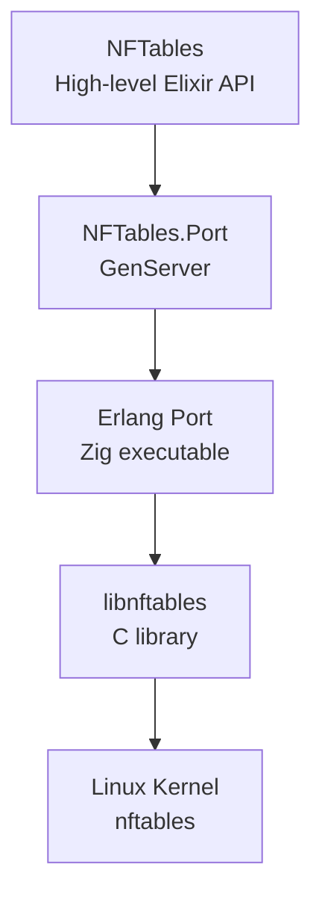

# NFTables.Port

NFTables.Port is the low-level communication layer that bridges Elixir and the Linux kernel's nftables firewall.

Port component for [NFTables](https://github.com/dcoai/nftables). Provides a Zig-based native port executable for communicating with Linux nftables via the official libnftables JSON API.

## Overview

NFTables.Port provides:

- **Native Zig Port Executable** - High-performance port process with `CAP_NET_ADMIN` capability
- **JSON Communication** - Uses the official nftables JSON API via libnftables
- **Automatic Framing** - 4-byte length-prefixed packets for reliable communication
- **Process Isolation** - Port process crashes don't affect the Elixir VM
- **Synchronous API** - Simple request/response pattern with timeout support

## Architecture



## Installation

Add `nftables_port` to your dependencies in `mix.exs`:

```elixir
def deps do
  [
    {:nftables_port, "~> 0.4.2"}
  ]
end
```

## Requirements

- **Linux kernel** with nftables support (kernel 3.13+)
- **libnftables** library installed (`nftables` package on most distros)
- **Zig compiler** (for building from source)
- **CAP_NET_ADMIN** capability on the port executable

### Setting Capabilities

The port executable requires `CAP_NET_ADMIN` to communicate with the kernel firewall:

```bash
# After compilation
sudo setcap cap_net_admin=ep priv/port_nftables
```

This is done automatically during `mix compile` if you have sudo access.

## Usage

### Direct Usage

```elixir
# Start the port
{:ok, pid} = NFTables.Port.start_link()

# Send a request to list tables
request = ~s({"nftables": [{"list": {"tables": {}}}]})
{:ok, response} = NFTables.Port.commit(pid, request)

# Parse response
{:ok, data} = Jason.decode(response)

# Stop the port
NFTables.Port.stop(pid)
```

### With NFTables

Typically, you'll use NFTables.Port indirectly through the NFTables high-level API, which provides a clean, idiomatic Elixir interface:

```elixir
{:ok, pid} = NFTables.Port.start_link()

json_cmd =
  Builder.new()
  |> Builder.add(table: "filter", family: :inet)
  |> Builder.add(chain: "INPUT", hook: :input, policy: :drop)
  |> Builder.add(rule: tcp() |> dport(22) |> accept())
  |> Builder.to_json()

{:ok, json_response} = NFTables.Port.call(pid, json_cmd)
```

NFTables.Builder provides a composable, type-safe way to build complex firewall rules. Behind the scenes, NFTables.Port handles all the JSON communication with nftables.

## Port Executable Location

The port executable is located using this resolution order:

1. `PORT_NFTABLES_PATH` environment variable (if set and file exists)
2. `/usr/local/sbin/port_nftables` (system-wide installation)
3. `/usr/sbin/port_nftables` (system-wide installation)
4. `priv/port_nftables` (development or application-bundled)

For production deployments, either:
- Set `PORT_NFTABLES_PATH` to specify a custom location
- Install to `/usr/local/sbin/port_nftables`

## Building from Source

The Zig port executable is built automatically during `mix compile`:

```bash
mix deps.get
mix compile
```

The build process:
1. Compiles the Zig source code in `native/src/`
2. Creates the executable at `priv/port_nftables`
3. Attempts to set `CAP_NET_ADMIN` capability (requires sudo)

## Installing to System Location

see [dev_docs/security.md] for information on how to keep you system secure.

For production deployments, install the port executable to a system location:

```bash
# Install to default location (/usr/local/sbin/port_nftables)
sudo mix nftables_port.install

# Install to custom location
sudo mix nftables_port.install /usr/sbin/port_nftables

# Install to custom directory (will create port_nftables in that directory)
sudo mix nftables_port.install /opt/nftables/bin/
```

The install task:
- Copies the compiled executable to the specified location
- Sets executable permissions (750)
- Sets `CAP_NET_ADMIN` capability with `setcap`
- Provides clear instructions if any step fails

After installation to a standard location (`/usr/local/sbin` or `/usr/sbin`), NFTables.Port will automatically find the executable. For custom locations, set the `PORT_NFTABLES_PATH` environment variable:

```bash
export PORT_NFTABLES_PATH=/opt/nftables/bin/port_nftables
```

## Testing

```bash
mix test
```

Note: Tests require:
- Root privileges or `CAP_NET_ADMIN` capability
- Linux system with nftables support

## Protocol

The port uses a simple length-prefixed packet protocol:

```
Request:  [4 bytes: length][N bytes: JSON string]
Response: [4 bytes: length][N bytes: JSON string]
```

Framing is handled automatically by Erlang's `{:packet, 4}` option.

## License

MIT License - see [LICENSE](LICENSE) for details.

## Related Projects

- [NFTables](https://github.com/yourusername/nftables) - High-level Elixir API for nftables
- [nftables](https://netfilter.org/projects/nftables/) - Linux kernel firewall

## Documentation

Full documentation is available at [HexDocs](https://hexdocs.pm/nftables_port).

