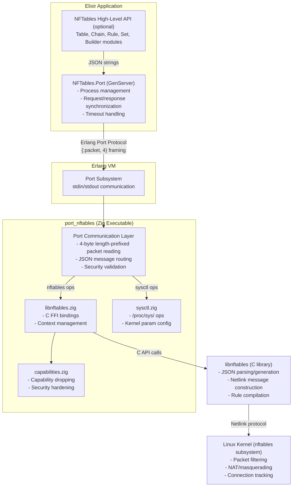
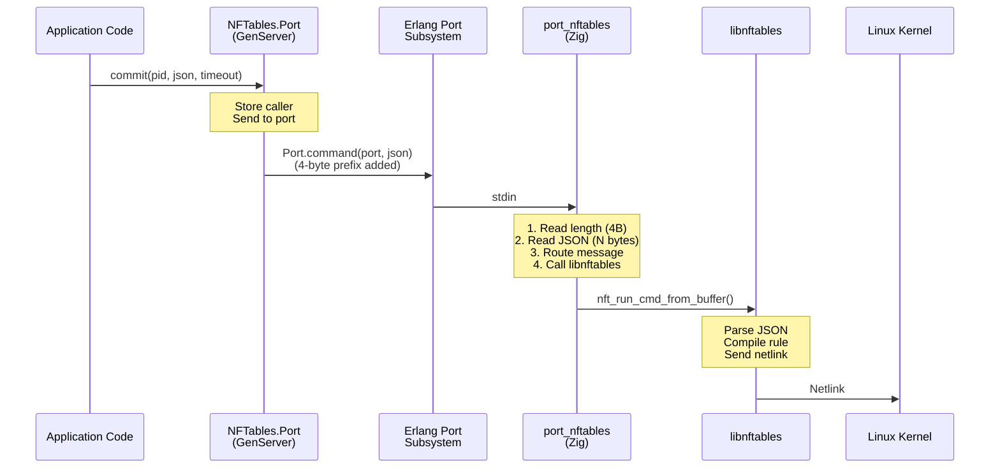
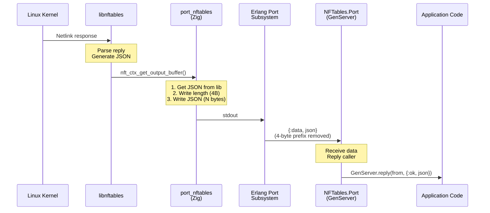
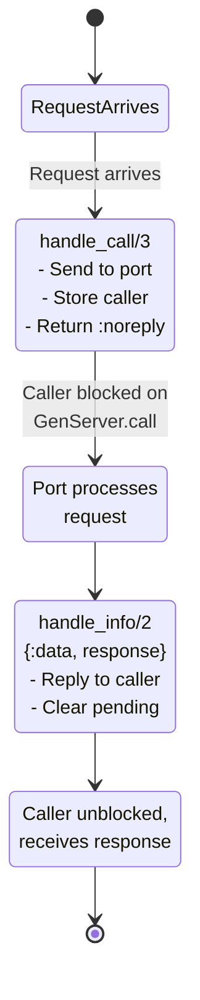
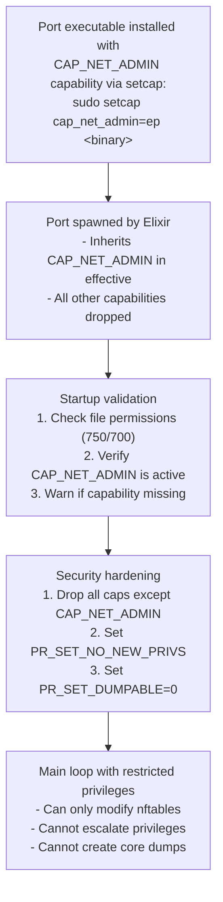
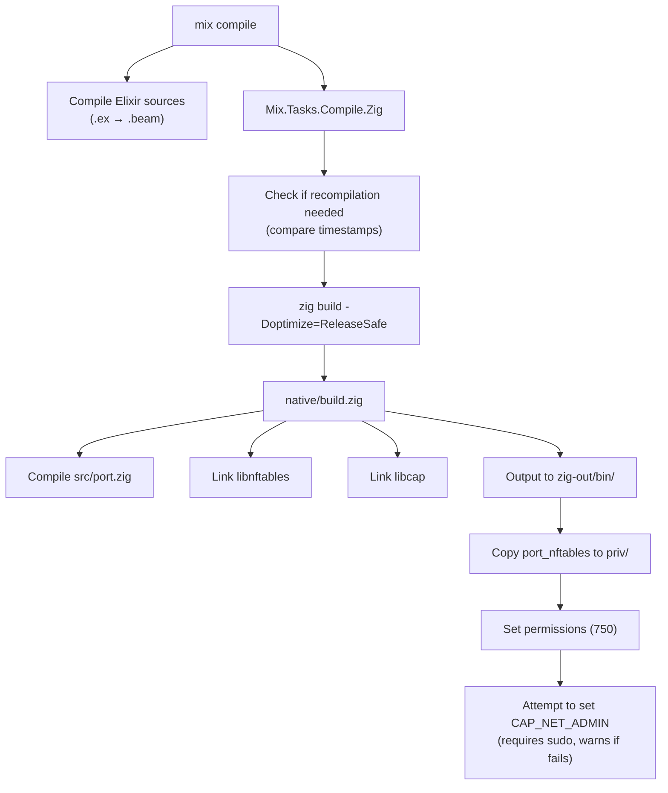

# NFTables.Port Architecture

This document provides a detailed architectural overview of NFTables.Port, a bridge between Elixir applications and the Linux kernel's nftables firewall subsystem.

## Table of Contents

1. [Overview](#overview)
2. [High-Level Architecture](#high-level-architecture)
3. [Component Details](#component-details)
4. [Communication Protocol](#communication-protocol)
5. [Data Flow](#data-flow)
6. [Process Lifecycle](#process-lifecycle)
7. [Port Discovery Mechanism](#port-discovery-mechanism)
8. [Security Architecture](#security-architecture)
9. [Error Handling](#error-handling)
10. [Build and Deployment](#build-and-deployment)

## Overview

NFTables.Port provides a secure, performant bridge between Elixir/OTP applications and Linux nftables. It uses an Erlang Port to communicate with a native Zig executable that interfaces with the kernel through libnftables.

### Design Goals

- **Security First**: Use Linux capabilities instead of root privileges
- **Isolation**: Port crashes don't affect the Erlang VM
- **Performance**: Native code with zero-copy where possible
- **Reliability**: Synchronous request/response with timeout support
- **Simplicity**: JSON-based protocol matching nftables' native API

## High-Level Architecture



## Component Details

### 1. Elixir Layer: NFTables.Port (GenServer)

**Location**: `lib/nftables_port.ex`

**Responsibilities**:
- Manage the lifecycle of the native port process
- Provide synchronous request/response API
- Handle port discovery and path resolution
- Monitor port health and handle crashes
- Enforce request timeouts

**Key Functions**:
- `start_link/1` - Spawn and initialize the port
- `commit/3` - Send JSON request and await response
- `stop/1` - Gracefully shut down the port

**State Management**:
```elixir
%State{
  port: port() | nil,              # Erlang port handle
  pending: GenServer.from() | nil, # Waiting caller
  check_capabilities: boolean()    # Startup validation flag
}
```

**Port Communication**:
- Uses `Port.open/2` with `{:spawn_executable, path}`
- Options: `[:binary, :exit_status, {:packet, 4}, :use_stdio]`
- `{:packet, 4}` provides automatic 4-byte length prefixing

### 2. Native Layer: port_nftables (Zig)

**Location**: `native/src/port.zig`

**Entry Point**: `main()`

**Responsibilities**:
1. **Security Validation**:
   - Check executable file permissions (must be 750/700)
   - Verify CAP_NET_ADMIN capability is active
   - Drop unnecessary capabilities after startup
   - Set security flags (PR_SET_NO_NEW_PRIVS, PR_SET_DUMPABLE)

2. **Communication Loop**:
   - Read 4-byte length prefix from stdin
   - Read JSON message of specified length
   - Route to appropriate handler (nftables or sysctl)
   - Write response with 4-byte length prefix to stdout

3. **Message Routing**:
   ```zig
   if (isSysctlMessage(json)) {
       response = handleSysctlMessage(allocator, json);
   } else {
       response = handleNftablesMessage(allocator, json);
   }
   ```

**Memory Management**:
- Uses Zig's arena allocator for request-scoped memory
- Automatic cleanup after each request
- No memory leaks between requests

### 3. FFI Layer: libnftables.zig

**Location**: `native/src/libnftables.zig`

**Responsibilities**:
- Provide safe Zig wrappers for C library functions
- Manage nftables context lifecycle
- Handle JSON input/output with libnftables

**Key Functions**:
```zig
extern fn nft_ctx_new(flags: u32) ?*nft_ctx;
extern fn nft_ctx_free(ctx: *nft_ctx) void;
extern fn nft_run_cmd_from_buffer(ctx: *nft_ctx, buf: [*:0]const u8) c_int;
extern fn nft_ctx_buffer_output(ctx: *nft_ctx) c_int;
extern fn nft_ctx_get_output_buffer(ctx: *nft_ctx) [*:0]const u8;
```

**Context Management**:
- One context per request (stateless design)
- Automatic output buffering
- Error code translation

### 4. Sysctl Layer: sysctl.zig

**Location**: `native/src/sysctl.zig`

**Responsibilities**:
- Handle kernel parameter operations via /proc/sys/
- Support get/set operations for network configuration
- Validate parameter names and values

**Operations**:
- **Get**: Read from `/proc/sys/{parameter}`
- **Set**: Write to `/proc/sys/{parameter}`

**JSON Protocol**:
```json
{
  "sysctl": {
    "operation": "get|set",
    "parameter": "net.ipv4.ip_forward",
    "value": "1"  // for set operations
  }
}
```

### 5. Security Layer: capabilities.zig

**Location**: `native/src/capabilities.zig`

**Responsibilities**:
- Check for CAP_NET_ADMIN capability
- Drop unnecessary capabilities after startup
- Set security hardening flags

**Security Measures**:
1. **Capability Check**: Verify CAP_NET_ADMIN is in effective set
2. **Privilege Dropping**: Drop all capabilities except CAP_NET_ADMIN
3. **No New Privileges**: Set `PR_SET_NO_NEW_PRIVS` to prevent escalation
4. **No Core Dumps**: Set `PR_SET_DUMPABLE=0` to prevent memory disclosure

## Communication Protocol

### Packet Framing

All messages use 4-byte big-endian length prefixing:

| Bytes 0-3 | Bytes 4-N |
|-----------|-----------|
| **Length** (4 bytes, big-endian) | **JSON Payload** (N bytes) |

**Example**:
```
Length: 0x00000034 (52 bytes)
JSON: {"nftables": [{"list": {"tables": {}}}]}
```

### Message Format

**Request** (Elixir → Zig):
```json
{
  "nftables": [
    {"add": {"table": {"family": "inet", "name": "filter"}}}
  ]
}
```

**Response** (Zig → Elixir):
```json
{
  "nftables": [
    {"metainfo": {"version": "1.0.5", "json_schema_version": 1}}
  ]
}
```

**Error Response**:
```json
{
  "nftables": [
    {"error": "Operation not permitted"}
  ]
}
```

### Synchronous Request/Response

NFTables.Port enforces a strict synchronous protocol:

1. Client sends request via `GenServer.call/3`
2. GenServer stores caller in `state.pending`
3. Port sends JSON to native executable
4. Native executable processes and responds
5. GenServer receives response
6. GenServer replies to original caller
7. `state.pending` cleared for next request

**No pipelining**: Only one request in flight at a time.

## Data Flow

### Request Path



### Response Path



## Process Lifecycle

### Startup Sequence

1. **Application Start**:
   ```elixir
   {:ok, pid} = NFTables.Port.start_link()
   ```

2. **GenServer Init**:
   ```elixir
   def init(opts) do
     state = %State{
       port: nil,
       pending: nil,
       check_capabilities: Keyword.get(opts, :check_capabilities, true)
     }
     {:ok, state, {:continue, :start_port}}
   end
   ```

3. **Port Discovery** (`handle_continue/2`):
   - Check `PORT_NFTABLES_PATH` environment variable
   - Try `/usr/local/sbin/port_nftables`
   - Try `/usr/sbin/port_nftables`
   - Fall back to `priv/port_nftables`

4. **Port Spawn**:
   ```elixir
   port = Port.open({:spawn_executable, port_path}, [
     :binary,
     :exit_status,
     {:packet, 4},
     :use_stdio
   ])
   ```

5. **Native Initialization** (Zig):
   - Validate file permissions
   - Check CAP_NET_ADMIN capability
   - Drop unnecessary capabilities
   - Set security flags
   - Enter main communication loop

### Steady State

In steady state, the system is idle and waiting for requests:

- **GenServer**: `pending = nil` (no active request)
- **Port Process**: Running, blocked on stdin waiting for 4-byte length prefix

### Request Processing



### Shutdown Sequence

1. **Graceful Stop**:
   ```elixir
   NFTables.Port.stop(pid)
   ```

2. **Terminate Callback**:
   ```elixir
   def terminate(_reason, state) do
     if state.port, do: Port.close(state.port)
     :ok
   end
   ```

3. **Port Cleanup**:
   - Port.close() sends EOF to stdin
   - Native process receives EOF
   - Native process exits
   - GenServer receives `{:exit_status, 0}`

### Crash Handling

**Port Crashes**:
```elixir
def handle_info({port, {:exit_status, status}}, state) do
  Logger.error("NFTables.Port exited with status #{status}")
  {:stop, {:port_exit, status}, state}
end
```

When the port crashes, the GenServer also terminates. Supervisor can restart if configured.

## Port Discovery Mechanism

### Resolution Order

```mermaid
flowchart TD
    start([PORT_NFTABLES_PATH env var]) --> check1{Exists?}
    check1 -->|Yes| use1[Use this path]
    check1 -->|No| path2[/usr/local/sbin/port_nftables]

    path2 --> check2{Exists?}
    check2 -->|Yes| use2[Use this path]
    check2 -->|No| path3[/usr/sbin/port_nftables]

    path3 --> check3{Exists?}
    check3 -->|Yes| use3[Use this path]
    check3 -->|No| path4[priv/port_nftables]

    path4 --> check4{Exists?}
    check4 -->|Yes| use4[Use this path]
    check4 -->|No| fail[Will fail at Port.open]

    use1 --> done([Port path resolved])
    use2 --> done
    use3 --> done
    use4 --> done
```

### Implementation

```elixir
defp get_port_path do
  case System.get_env("PORT_NFTABLES_PATH") do
    nil -> find_port_in_system()
    path when is_binary(path) ->
      if File.exists?(path), do: path, else: find_port_in_system()
  end
end

defp find_port_in_system do
  system_paths = [
    "/usr/local/sbin/port_nftables",
    "/usr/sbin/port_nftables"
  ]
  Enum.find(system_paths, &File.exists?/1) || fallback_port_path()
end

defp fallback_port_path do
  cond do
    Code.ensure_loaded?(Mix.Project) ->
      # Development
      case :code.priv_dir(:nftables_port) do
        {:error, _} -> "native/zig-out/bin/port_nftables"
        dir -> Path.join(to_string(dir), "port_nftables")
      end
    true ->
      # Production release
      Application.app_dir(:nftables_port, "priv/port_nftables")
  end
end
```

### Rationale

1. **Environment Variable**: Override for testing or custom deployments
2. **System Paths**: Standard locations for production installations
3. **Priv Directory**: Development and embedded deployments
4. **Native Build**: Fallback during development before `mix compile`

## Security Architecture

### Threat Model

See `dev_docs/security.md` for full details. Summary:

**Threats**:
- Unauthorized firewall modification
- Privilege escalation
- Memory disclosure (core dumps)
- Arbitrary code execution via compromised binary

**Mitigations**:
- Linux capabilities (CAP_NET_ADMIN only)
- File permission validation (750/700)
- Capability dropping after initialization
- PR_SET_NO_NEW_PRIVS flag
- PR_SET_DUMPABLE=0 flag
- Process isolation via Erlang Port

### Capability Flow



## Error Handling

### Elixir Layer

**Timeout Handling**:
```elixir
def commit(pid, request, timeout \\ 5_000) do
  GenServer.call(pid, {:request, request}, timeout)
end
```
- Default 5-second timeout
- Returns `{:error, :timeout}` if exceeded
- Caller can handle and retry

**Port Exit**:
```elixir
def handle_info({port, {:exit_status, status}}, state) do
  Logger.error("NFTables.Port exited with status #{status}")
  {:stop, {:port_exit, status}, state}
end
```
- Logs error with exit status
- GenServer terminates
- Supervisor can restart

### Native Layer

**Communication Errors**:
- EOF on stdin → Clean shutdown
- Invalid length → Log and skip
- JSON parse error → Return error JSON

**libnftables Errors**:
```zig
const rc = libnftables.nft_run_cmd_from_buffer(ctx, json_cstr);
if (rc != 0) {
    // Error occurred, but output buffer may contain error message
    const output = libnftables.nft_ctx_get_output_buffer(ctx);
    return allocator.dupe(u8, std.mem.span(output));
}
```
- Non-zero return code indicates error
- Error details in output buffer
- Returned as JSON to caller

**Capability Errors**:
```zig
if (!capabilities.hasCapNetAdmin()) {
    std.debug.print("warning: CAP_NET_ADMIN capability is not active\n", .{});
    std.debug.print("warning: Note: Netlink operations requiring CAP_NET_ADMIN will fail\n", .{});
}
```
- Warning printed to stderr
- Operation continues (will fail at kernel boundary)
- Allows testing without capabilities

## Build and Deployment

### Build Architecture



### Build Configuration

**native/build.zig**:
```zig
const exe = b.addExecutable(.{
    .name = "port_nftables",
    .root_source_file = .{ .path = "src/port.zig" },
    .target = target,
    .optimize = optimize,
});

exe.linkLibC();
exe.linkSystemLibrary("nftables");
exe.linkSystemLibrary("cap");

b.installArtifact(exe);
```

### Deployment Paths

**Development**:
```
nftables_port/
├── priv/
│   └── port_nftables  (built by mix compile)
└── native/
    └── zig-out/
        └── bin/
            └── port_nftables  (built by zig)
```

**Production (System Installation)**:
```
/usr/local/sbin/port_nftables
or
/usr/sbin/port_nftables
```

Installed via:
```bash
sudo mix nftables_port.install [PATH]
```

**Production (Release)**:
```
_build/prod/rel/myapp/
└── lib/
    └── nftables_port-0.4.0/
        └── priv/
            └── port_nftables
```

Bundled in release, found via `Application.app_dir/2`.

## Performance Considerations

### Zero-Copy Where Possible

- Erlang Port uses binary mode (no string conversion)
- Zig uses arena allocator (batch free)
- JSON passed as raw bytes

### Synchronous Design Trade-offs

**Pros**:
- Simple error handling
- Natural backpressure
- Clear request ordering

**Cons**:
- One request at a time
- Caller blocked during processing

**Rationale**: Firewall changes are typically infrequent and order-dependent. Simplicity and correctness trump throughput.

### Memory Usage

- Each request allocates arena (~few KB)
- Arena freed after response
- No persistent allocations between requests
- GenServer state is minimal (< 1 KB)

## Testing Architecture

### Unit Tests

**Elixir**: `test/nftables_port_test.exs`
- Tests GenServer lifecycle
- Tests JSON communication
- Tests error handling
- Requires CAP_NET_ADMIN or root

**Test Isolation**:
```elixir
setup do
  {:ok, pid} = NFTables.Port.start_link(check_capabilities: false)
  cleanup_tables(pid)
  on_exit(fn -> cleanup_tables(pid) end)
  {:ok, port: pid}
end
```

### Integration Testing

Tests interact with real kernel nftables:
- Create test tables
- Add chains and rules
- Verify state
- Clean up after tests

## Future Considerations

### Potential Enhancements

1. **Asynchronous Mode**: Optional async API for fire-and-forget operations
2. **Batch Operations**: Multiple commands in one port call
3. **Streaming**: Large ruleset operations with chunked responses
4. **Metrics**: Request timing, error rates, queue depth
5. **Hot Reload**: Restart port without restarting GenServer

### Backward Compatibility

Changes to the protocol or API must maintain compatibility:
- Version negotiation in JSON protocol
- Feature detection via capability queries
- Graceful degradation for missing features

---

**Document Version**: 1.0
**Last Updated**: 2025-12-01
**Maintainer**: NFTables.Port team
