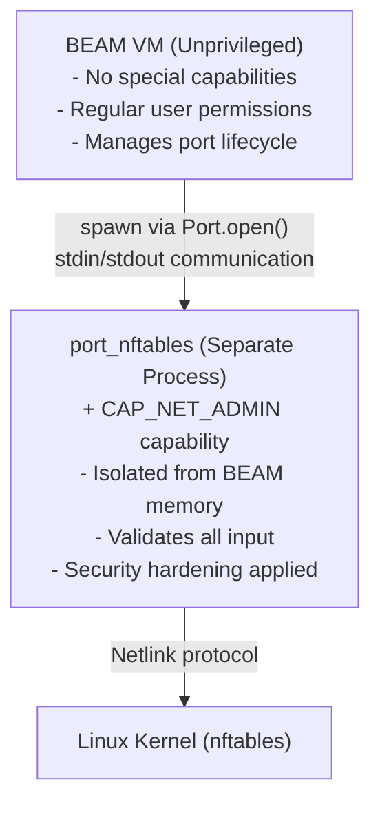
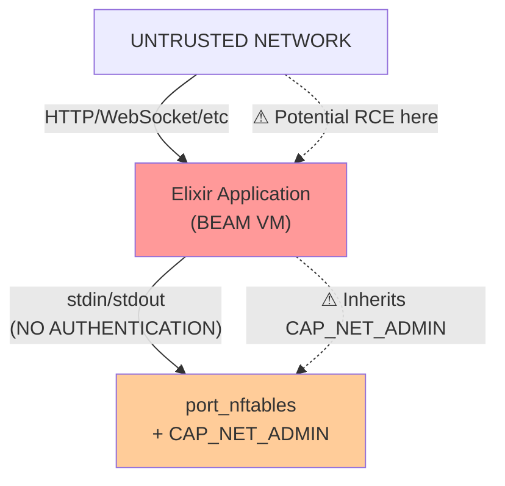

# Security Documentation

This is a big scarey document, with the intent of helping with awareness of how things might go wrong if care isn't taken with this module.

## Overview

This module provides access to network configuration, it is important to have awareness of how this could be misused and what should be kept in mind when making use of this module.  If you find anything that is incorrect or missing submit a PR.

NFTables.Port is a security-critical component that bridges Elixir applications with the Linux kernel's nftables firewall subsystem. This document focuses specifically on the security implications of using Linux capabilities (`CAP_NET_ADMIN`) with a native port process in the context of the BEAM VM and Erlang distribution system.

**Key Security Principle:** The port process with `CAP_NET_ADMIN` must be treated as a high-value target. A compromise of either the BEAM VM or the Erlang distribution system can lead to abuse of firewall modification capabilities.

## Primary Mitigations

The following items can help minimize risk when using this module and port.

1. Don't put this in a BEAM VM which is reachable via the public network.
2. Disable EPMD on the BEAM VM on which this will be running.
3. This should not run on a BEAM VM with other unrelated applications.
4. Running this as a short lived script.
5. Do some real risk analysis and ensure that you have educated yourself and understand the ramificationsn of what a compromised service will result in... possible lost/stolen work, lost/stolen data, and many other things.  If routing is enabled the computer this is used on (which can be done), then the ramifications can be wider spread.

## CAP_NET_ADMIN Capability

### What is CAP_NET_ADMIN?

`CAP_NET_ADMIN` is a Linux capability that grants a process specific privileges related to network administration. It's part of Linux's capability system, which divides traditional root privileges into distinct units that can be granted independently.

### Why NFTables.Port Needs CAP_NET_ADMIN

The port executable requires `CAP_NET_ADMIN` to perform netlink operations that communicate with the kernel's nftables subsystem:

1. **Open NETLINK_NETFILTER sockets** - Direct communication channel to the kernel firewall
2. **Send nftables configuration commands** - Create/modify/delete firewall rules
3. **Receive kernel responses** - Query current firewall state

**Specific Operations Requiring CAP_NET_ADMIN:**
- Creating/deleting nftables tables
- Creating/deleting chains
- Adding/removing firewall rules
- Modifying sets (IP lists, port lists)
- Querying firewall state

Without this capability, all operations fail with `EPERM` (Operation not permitted).

### Security Implications of CAP_NET_ADMIN

`CAP_NET_ADMIN` is a powerful capability that allows:

**What it enables:**
- Modify firewall rules (intended use)
- Configure network interfaces
- Manage routing tables
- Configure IPsec
- Configure network namespaces

**What it does NOT allow:**
- Read arbitrary files
- Write to arbitrary files
- Kill other processes
- Modify other users' processes
- Gain additional capabilities

**Attack Scenarios if CAP_NET_ADMIN is Compromised:**

1. **Firewall Bypass** - Attacker opens holes in firewall to allow malicious traffic
2. **Network Redirection** - Modify routing to intercept/redirect traffic
3. **Denial of Service** - Drop all traffic with firewall rules
4. **Data Exfiltration** - Redirect sensitive traffic to attacker-controlled servers
5. **Lateral Movement** - Open firewall to enable attacks on other systems

### Principle of Least Privilege

NFTables.Port follows the principle of least privilege:

- **Only the port binary** has `CAP_NET_ADMIN`, not the entire BEAM VM
- The capability is set via **file capabilities** (`setcap cap_net_admin+ep`)
- **No other capabilities** are granted to the port process
- The BEAM VM runs as a **regular unprivileged user**

## Port Process Security Model

### Architecture Overview



### How Erlang Ports Work

**Key Characteristics:**
1. **Separate OS Process** - The port runs as its own process, completely separate from the BEAM VM
2. **Parent-Child Relationship** - BEAM spawns the port via `fork()` + `execve()`
3. **Communication** - stdin/stdout with 4-byte length-prefixed packets
4. **Fault Isolation** - Port crashes don't crash the BEAM VM (only GenServer terminates)

**Important: Fault Isolation ≠ Security Isolation**

While crashes are isolated, **security is NOT isolated**:
- BEAM controls the port's stdin (can send arbitrary data)
- BEAM can send signals to the port
- BEAM can terminate the port at any time

### Capability Inheritance

**How Capabilities are Inherited:**

When the BEAM VM spawns the port process:

1. **Before spawn:** Port binary has file capability `cap_net_admin+ep` (set via `setcap`)
2. **During execve():** Kernel automatically grants `CAP_NET_ADMIN` to the new process
3. **After spawn:** Port process has `CAP_NET_ADMIN` in its effective and permitted sets
4. **BEAM VM never has `CAP_NET_ADMIN`** - it's inherited by the port binary, not the parent

**File Capability Format:**
```bash
sudo setcap cap_net_admin+ep priv/port_nftables
#                          │└─ p = permitted (capability is permitted)
#                          └── e = effective (capability is effective at startup)
```

### Security Hardening Measures

The port implements multiple layers of defense:

#### 1. File Permission Validation

**Enforced at Startup:**

The port checks its own file permissions before processing any requests:

```
Required: 750 (rwxr-x---) or 700 (rwx------)
Rejected: 755 (rwxr-xr-x) - world-executable
```

**Rationale:** If the binary is world-executable, any user could execute it and inherit `CAP_NET_ADMIN`. By rejecting loose permissions, we prevent unauthorized users from gaining network admin capabilities.

**Implementation:** See `native/src/port.zig` - permission check before main loop

#### 2. PR_SET_NO_NEW_PRIVS Flag

**What it does:** Prevents the process from ever gaining additional privileges

```c
prctl(PR_SET_NO_NEW_PRIVS, 1, 0, 0, 0);
```

**Protection against:**
- Executing setuid binaries (would normally grant elevated privileges)
- Gaining capabilities through file capabilities on other executables
- Privilege escalation exploits

**Result:** Even if an attacker finds a code execution vulnerability in the port, they cannot escalate to gain additional privileges beyond `CAP_NET_ADMIN`.

#### 3. PR_SET_DUMPABLE=0 Flag

**What it does:** Prevents core dumps and debugging of the process

```c
prctl(PR_SET_DUMPABLE, 0, 0, 0, 0);
```

**Protection against:**
- Core dump memory disclosure (if port crashes, no core file created)
- Debugging via `ptrace()` (prevents attaching debuggers)
- Reading `/proc/<pid>/mem` and other process memory

**Rationale:** Core dumps and debuggers could leak sensitive information like:
- Environment variables
- Memory contents of firewall rules
- JSON messages in transit

#### 4. Capability Dropping

**Current behavior:** Port keeps `CAP_NET_ADMIN` for its entire lifecycle

**Best practice:** Port should drop all capabilities except `CAP_NET_ADMIN` from the bounding set

**Implementation location:** `native/src/capabilities.zig`

#### 5. Input Validation

**All JSON input from BEAM is validated:**
- JSON schema validation
- Length limits on strings
- Type checking
- Range validation

keep in mind this does not protect at all from malicious messages if the BEAM VM is compromised.

### Process Isolation

**What's Isolated:**
- Memory space (port cannot read BEAM memory, BEAM cannot read port memory)
- File descriptors (separate fd tables)
- Crash boundaries (port crash → GenServer terminate, not VM crash)

**What's NOT Isolated:**
- stdin/stdout (BEAM controls what port receives)
- Signals (BEAM can send signals to port)
- Filesystem (same filesystem access)
- Network (same network namespace)

## Security Implications with BEAM/EPMD

This section covers security concerns specific to running a capability-enabled port in the Erlang/Elixir ecosystem.

### Trust Boundary

**Critical Understanding:** There is NO security boundary between BEAM and the port process.  Consequently, if BEAM is compromised, the hosts network will be as well.



**Implication:** If an attacker achieves remote code execution in your Elixir application, they can send arbitrary JSON to the port and modify firewall rules, or change sysctl network parameters.

### BEAM Compromise Scenarios

#### Scenario 1: Web Application Vulnerability → RCE (Remote Code Execution)

**Attack Chain:**
1. Attacker finds RCE vulnerability in web application (SQL injection → code exec, deserialization bug, etc.)
2. Attacker gains code execution in BEAM VM
3. Attacker locates the NFTables.Port GenServer (via `:erlang.processes()` + `:sys.get_state/1`)
4. Attacker sends malicious JSON commands to port's stdin
5. Port executes commands (has CAP_NET_ADMIN)
6. Firewall is compromised

**Example Attack Code (if attacker achieves code exec):**
```elixir
# Attacker running in compromised BEAM
{:ok, pid} = NFTables.Port.start_link()

# Open firewall to attacker's server
malicious_json = ~s({
  "nftables": [{
    "add": {
      "rule": {
        "family": "inet",
        "table": "filter",
        "chain": "input",
        "expr": [{"accept": null}]
      }
    }
  }]
})

NFTables.Port.commit(pid, malicious_json)
```

**Mitigation:**
- First, don't make a web application that uses this module. (primary defense)
- If you absolutely must, Secure your web application
- Validate all JSON at port level (defense in depth)
- Monitor firewall changes (detection)
- Rate limit port operations (slow down attacker)

#### Scenario 2: Erlang Distribution Compromise

**Attack Chain:**
1. Attacker gains access to Erlang distribution cookie (`.erlang.cookie` file, env var, brute force)
2. Attacker connects to node using cookie
3. Attacker executes `:rpc.call(node, NFTables.Port, :commit, [pid, malicious_json])`
4. Firewall is compromised

**Mitigation:**
- Disable `epmd` on BEAM instances this runs on.
- or if you must have it: Firewall Erlang distribution ports (4369, high ports)
- Use TLS for distribution (`-proto_dist inet_tls`)
- Strong cookie (not default)
- Don't expose EPMD to public networks

### EPMD Security Concerns

#### What is EPMD?

**EPMD (Erlang Port Mapper Daemon)** is a name service for Erlang nodes:

- Runs on TCP port **4369** (well-known port)
- Maps node names to distribution ports
- **No authentication** by default
- Starts automatically when first Erlang node starts

**Example EPMD interaction:**
```bash
# Query EPMD (unauthenticated)
$ epmd -names
epmd: up and running on port 4369 with data:
name myapp at port 35467

# Attacker now knows:
# - Node name: myapp
# - Distribution port: 35467
```

#### EPMD as Attack Vector

**Problem:** EPMD leaks cluster topology to unauthenticated network peers.

**Attack Scenario:**
1. **Enumeration:** Attacker connects to port 4369, queries node names and ports
2. **Port Discovery:** Attacker learns distribution port (e.g., 35467)
3. **Cookie Brute Force:** Attacker attempts to connect with common cookies
4. **Cluster Access:** If cookie is guessed, attacker gains full cluster access
5. **RCE:** Attacker uses `:rpc.call/4` to execute arbitrary code
6. **Port Compromise:** Attacker sends malicious commands to capability-enabled port

**Real-World Data:**
- Shodan shows 85,000+ publicly accessible EPMD instances
- Default cookies are predictable (`~/.erlang.cookie` often has weak generation)
- MD5 challenge-response (not cryptographically secure)

#### EPMD Hardening

**1. Bind to Loopback (Recommended)**

Prevent EPMD from accepting external connections:

```bash
# Set before starting any Erlang node
export ERL_EPMD_ADDRESS=127.0.0.1

# Or in systemd unit file
Environment="ERL_EPMD_ADDRESS=127.0.0.1"
```

**2. Firewall EPMD Port**

```bash
# Allow only from internal network
iptables -A INPUT -p tcp --dport 4369 -s 10.0.0.0/8 -j ACCEPT
iptables -A INPUT -p tcp --dport 4369 -j DROP

# Or with nftables
nft add rule inet filter input tcp dport 4369 ip saddr 10.0.0.0/8 accept
nft add rule inet filter input tcp dport 4369 drop
```

**3. Use Custom EPMD Port**

```bash
export ERL_EPMD_PORT=12345  # Non-standard port
```

**4. Firewall Distribution Ports**

Distribution uses high ephemeral ports. Restrict the range and firewall it:

```bash
# In vm.args or releases
-kernel inet_dist_listen_min 9100
-kernel inet_dist_listen_max 9200

# Firewall
nft add rule inet filter input tcp dport 9100-9200 ip saddr 10.0.0.0/8 accept
nft add rule inet filter input tcp dport 9100-9200 drop
```

### Cookie Authentication Weaknesses

**How Cookie Auth Works:**

1. Node A connects to Node B
2. Node B sends challenge (random bytes)
3. Node A computes: `MD5(Challenge ++ Cookie)`
4. Node B verifies response matches `MD5(Challenge ++ Cookie_own)`
5. If match → authenticated

**Security Issues:**

1. **MD5 is broken** - Cryptographically insecure hash function
2. **No forward secrecy** - Same cookie used for all connections
3. **No MITM protection** - Cookie can be intercepted if sniffed
4. **Brute force feasible** - MD5 is fast, cookies often weak

**Common Weak Cookies:**
- `cookie` (default in some setups)
- Hostname-based (predictable)
- Short random strings (brute-forceable)

**Better Cookie Generation:**
```bash
# Generate strong random cookie
openssl rand -base64 32 > ~/.erlang.cookie
chmod 400 ~/.erlang.cookie
```

### stdin/stdout Security

**Protocol:** BEAM ↔ Port communication via stdin/stdout

**Characteristics:**
- **No encryption** - All data in plaintext
- **No authentication** - BEAM is assumed to own the port
- **No integrity protection** - BEAM can send arbitrary bytes

**Threat Model:**

If BEAM is compromised:
- Attacker controls stdin → Can send malicious JSON
- Attacker reads stdout → Can see firewall state
- No defense at this layer

**Mitigation:**

Realistically if we are here, all is lost.

### Attack Vectors Summary

| Attack Vector | Entry Point | Impact | Mitigation |
|---------------|-------------|--------|------------|
| **Web RCE → BEAM** | Application vulnerability | Full port control | Secure application code |
| **EPMD enumeration** | Port 4369 | Cluster topology leak | Firewall + bind to localhost |
| **Cookie brute force** | Distribution port | Full cluster access | Strong cookie + TLS |
| **stdin injection** | Compromised BEAM | Malicious port commands | Input validation at port |
| **Binary tampering** | Filesystem write access | Replace port with malicious version | File permissions + integrity monitoring |
| **Signal attacks** | Compromised BEAM | DoS (SIGKILL port) | Monitor port restarts |

### Defense in Depth Strategy

**Layer 1: Network Perimeter**
- Firewall EPMD (port 4369) to internal networks only
- Firewall distribution ports (9100-9200) to internal networks
- Use TLS for distribution (`-proto_dist inet_tls`)

**Layer 2: Erlang Distribution**
- Strong random cookie (32+ bytes, cryptographically random)
- Bind EPMD to localhost when possible
- Consider not running distributed mode if not needed

**Layer 3: Application Security**
- Secure web application (prevent RCE)
- Input validation before calling NFTables.Port
- Rate limiting on firewall operations
- Logging and monitoring

**Layer 4: Port Process**
- File permission validation (750/700)
- JSON schema validation
- Semantic validation (table names, families, etc.)
- Input length limits

**Layer 5: System Security**
- SELinux/AppArmor policies
- Filesystem integrity monitoring (AIDE, Tripwire)
- Process monitoring (unexpected CAP_NET_ADMIN processes)
- Audit logging (`auditd`)

## Hardening Guidelines

### Production Deployment Checklist

**EPMD/Distribution:**
- [ ] EPMD bound to localhost (`ERL_EPMD_ADDRESS=127.0.0.1`)
- [ ] Port 4369 firewalled to internal networks only
- [ ] Distribution ports firewalled (9100-9200 to internal only)
- [ ] Strong cookie (32+ bytes, generated via `openssl rand -base64 32`)
- [ ] Cookie file has permissions 400 (`chmod 400 ~/.erlang.cookie`)
- [ ] TLS enabled for distribution (`-proto_dist inet_tls`)

**Port Binary:**
- [ ] CAP_NET_ADMIN set (`getcap priv/port_nftables` shows `cap_net_admin+ep`)
- [ ] File permissions 750 or 700 (`ls -l priv/port_nftables`)
- [ ] Binary owned by application user, not root
- [ ] Binary location not world-writable (`/opt/app/priv/`, not `/tmp/`)

**System:**
- [ ] Application runs as non-root user
- [ ] AppArmor/SELinux profiles applied (if available)
- [ ] File integrity monitoring enabled (AIDE/Tripwire)
- [ ] Audit logging enabled (`auditd` with capability monitoring)

**Monitoring:**
- [ ] Alert on unexpected processes with CAP_NET_ADMIN
- [ ] Alert on distribution connections from unexpected IPs
- [ ] Alert on port process crashes/restarts
- [ ] Log all firewall rule changes
- [ ] Monitor EPMD connection attempts

### Monitoring Examples

**Detect Unexpected CAP_NET_ADMIN Processes:**

```bash
#!/bin/bash
# Check for processes with CAP_NET_ADMIN that aren't our port

EXPECTED_PORT="port_nftables"

for pid in /proc/[0-9]*; do
  capeff=$(grep CapEff: $pid/status 2>/dev/null | awk '{print $2}')
  # CAP_NET_ADMIN is bit 12 (0x1000 in hex)
  if [[ $((0x$capeff & 0x1000)) -ne 0 ]]; then
    cmdline=$(cat $pid/cmdline 2>/dev/null | tr '\0' ' ')
    if [[ ! "$cmdline" =~ "$EXPECTED_PORT" ]]; then
      echo "ALERT: Unexpected CAP_NET_ADMIN process: $cmdline (PID: ${pid##*/})"
    fi
  fi
done
```

**Monitor Port Restarts:**

```elixir
defmodule NFTables.PortMonitor do
  use GenServer

  def init(_) do
    {:ok, %{restarts: 0, last_restart: nil}}
  end

  def handle_info({:port_exit, reason}, state) do
    new_state = %{
      restarts: state.restarts + 1,
      last_restart: DateTime.utc_now()
    }

    # Alert if too many restarts
    if new_state.restarts > 5 do
      Logger.error("SECURITY ALERT: Port restarted #{new_state.restarts} times")
      # Send alert to security monitoring
    end

    {:noreply, new_state}
  end
end
```

**Monitor Firewall Changes:**

```bash
# Log all nft commands via auditd
auditctl -w /usr/sbin/nft -p x -k nftables_exec
auditctl -w /proc/net/netlink -p rwa -k netlink_access
```

### TLS Configuration for Distribution

**Generate Certificates:**

```bash
# CA certificate
openssl req -x509 -newkey rsa:4096 -keyout ca-key.pem -out ca-cert.pem -days 3650 -nodes

# Node certificate
openssl req -newkey rsa:4096 -keyout node-key.pem -out node-req.pem -nodes
openssl x509 -req -in node-req.pem -CA ca-cert.pem -CAkey ca-key.pem -CAcreateserial -out node-cert.pem -days 3650
```

**Configure Erlang/Elixir:**

```elixir
# config/runtime.exs
config :kernel,
  inet_dist_use_interface: {127, 0, 0, 1},  # Bind to localhost
  inet_dist_listen_min: 9100,
  inet_dist_listen_max: 9200

# vm.args
-proto_dist inet_tls
-ssl_dist_optfile /path/to/ssl_dist.config
```

**ssl_dist.config:**
```erlang
[
  {server, [
    {certfile, "/path/to/node-cert.pem"},
    {keyfile, "/path/to/node-key.pem"},
    {cacertfile, "/path/to/ca-cert.pem"},
    {verify, verify_peer},
    {fail_if_no_peer_cert, true}
  ]},
  {client, [
    {certfile, "/path/to/node-cert.pem"},
    {keyfile, "/path/to/node-key.pem"},
    {cacertfile, "/path/to/ca-cert.pem"},
    {verify, verify_peer}
  ]}
].
```

## Security Checklist

### Critical Security Items

- [ ] **CAP_NET_ADMIN set correctly** on port binary only
- [ ] **File permissions 750 or 700** on port binary (not 755)
- [ ] **EPMD bound to localhost** or firewalled
- [ ] **Distribution ports firewalled** to internal network
- [ ] **Strong cookie** (32+ bytes, cryptographically random)
- [ ] **TLS enabled** for distribution (production)
- [ ] **Port runs as non-root** user
- [ ] **JSON validation** in port process
- [ ] **Monitoring enabled** for CAP_NET_ADMIN processes
- [ ] **Alert on port crashes** (potential attack indicator)

### Additional Hardening

- [ ] SELinux/AppArmor profiles applied
- [ ] File integrity monitoring (AIDE/Tripwire)
- [ ] Audit logging enabled (`auditd`)
- [ ] Regular security updates applied
- [ ] Incident response plan documented
- [ ] Security testing performed (penetration test)

## Further Reading

### Linux Capabilities
- [capabilities(7) man page](https://man7.org/linux/man-pages/man7/capabilities.7.html)
- [Linux Capability FAQ](https://www.kernel.org/doc/html/latest/userspace-api/no_new_privs.html)

### Erlang Distribution Security
- [Erlang Distribution Protocol](https://www.erlang.org/doc/apps/erts/erl_dist_protocol.html)
- [Securing Erlang Distribution](https://www.erlang.org/doc/apps/ssl/ssl_distribution.html)
- [EPMD Security Considerations](https://erlef.github.io/security-wg/secure_coding_and_deployment_hardening/epmd)

### nftables Security
- [nftables Wiki](https://wiki.nftables.org/)
- [netfilter Documentation](https://www.netfilter.org/documentation/)

---

**Document Version:** 2.0
**Last Updated:** 2025-12-01
**Focus:** CAP_NET_ADMIN, Port Process Security, BEAM/EPMD Security
